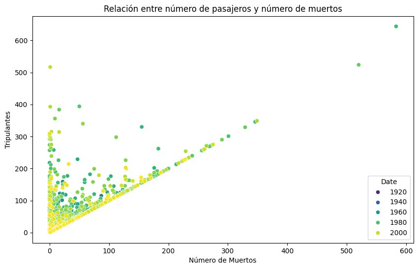
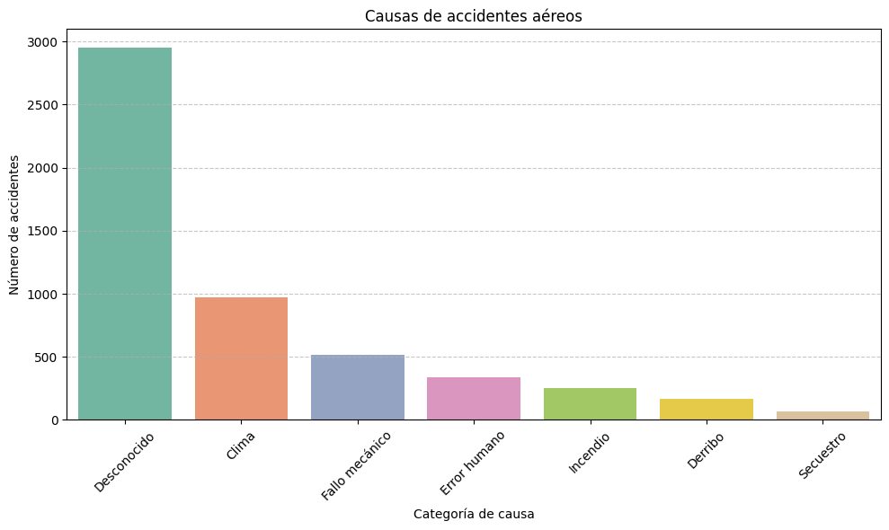
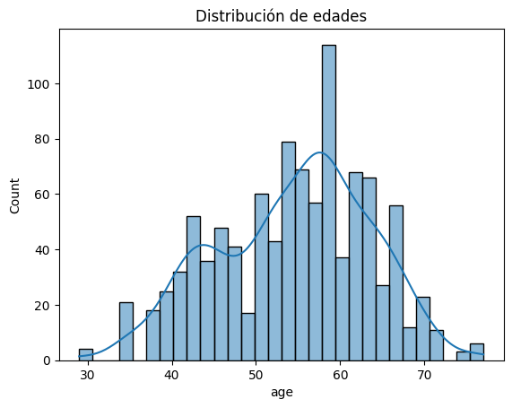
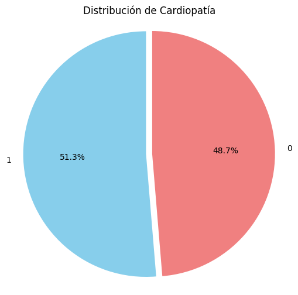

# Analisis general
Se realiza el estudio de 3 conjuntos de datos con la finidad de aplicar algoritmos de Clasificación, Regresión lineal y Clustering. 
Para todos se desarrolla un Analisis Exploratorio de los Datos,  Obtención de caracteristicas, Entrenamiento, optimización y selección de modelos de ML.

Para correr cada proyecto en los notebooks de Google Colab, es necesario porner los ficheros de data csv en el directorio sample_data/ del propio Google Colab.

## Accidentes aéreos desde 1908

Un conjunto de datos de 1988 y consta de cuatro bases de datos: Cleveland, Hungría, Suiza y Long Beach V. Contiene 76 atributos, incluido el atributo predicho, pero todos los experimentos publicados utilizan un subconjunto de 14 de ellos. El campo "objetivo" se refiere a la presencia de cardiopatía en el paciente. Su valor es entero: 0 = sin cardiopatía y 1 = con cardiopatía.

La data está relacionada al fichero Accidentes_Aereos (CLUSTERING).ipynb" y se puede acceder directamente al Google Colab en el siguiente enlace: https://colab.research.google.com/drive/1ykGfa0cxd_3RHXhHQo6RZA2xvoa_wC82#scrollTo=7NG4DVmjiWEK

Mediante un conjunto de datos de Kaggle (fichero 'sample_data/Airplane_Crashes_and_Fatalities_Since_1908.csv').

Se evalua el conjunto de datos con los siguientes Algoritmos:

Para clasificación (Causas del accidente):
* Random Forest Classifier
* XGBoost Classifier
* Logistic Regression (si reduces clases)
* Naive Bayes (si haces ingeniería de texto sobre el Summary)
* Para regresión (muertes):

Linear Regression
* Random Forest Regressor
* XGBoost Regressor
* Redes neuronales (MLPRegressor)

Para agrupación (no supervisado):
* K-Means
* DBSCAN
* PCA para reducción de dimensionalidad

Metricas recomendadas
* MAE (Error Absoluto Medio)
* MSE (Error Cuadrático Medio)
* R² (Coeficiente de determinación)

Conclusión final, evaluando los 3 tipos de modelos.

Según los datos arrojados, los que dan mejor rendimiento según el tipo, son:
* En clasificación: XGBoost con 96%
* En regresión: MLPRegressor con MAE: 8.61, MSE: 454.95, R²: 0.60
* En Clustering: KMeans, La distribución es más limpia y estructurada comparada con DBSCAN.

  
## 

## Estudio de canales publicitarios 

Esta relacionado al fichero "Canales_publicitarios (REGRESION_LINEAL).ipynb" y se puede acceder directamente al Google Colab por el siguiente enlace: https://colab.research.google.com/drive/1-aKW4px1g0YOpYZUVYqBM1wtrYsxqrIC

Mediante el conjunto de datos de Kaggle (fichero 'sample_data/Advertising_Data.csv'), el cual consta de siete columnas que representan los costos publicitarios en diversas plataformas: televisión, vallas publicitarias, Google Ads, redes sociales, marketing de influencers, marketing de afiliación y por último "Product_Sold", que cuantifica el número correspondiente de unidades vendidas, se investiga el impacto de la publicidad en las ventas de productos.

Se evalua el conjunto de datos con los siguientes Algoritmos:
*   Regresión lineal múltiple
*   Árboles de decisión / Random Forest
*   XGBoost / Gradient Boosting
*   Red neuronal (MLPRegressor de sklearn o Keras)

## Anális de cardiopatía

Un conjunto de datos de 1988 y consta de cuatro bases de datos: Cleveland, Hungría, Suiza y Long Beach V. Contiene 76 atributos, incluido el atributo predicho, pero todos los experimentos publicados utilizan un subconjunto de 14 de ellos. Mediante un conjunto de datos de Kaggle (fichero 'sample_data/heart.csv').

El campo "objetivo" (tarjet) se refiere a la presencia de cardiopatía en el paciente. Su valor es entero: 0 = sin cardiopatía y 1 = con cardiopatía.

La data está relacionada al fichero "Cardiopatia (CLASIFICACIÓN).ipynb" y se puede acceder directamente al Google Colab por el siguiente enlace: https://colab.research.google.com/drive/1qN-jNW1-qmmFOeAd1EOjY6zT9qkSwmei#scrollTo=7NG4DVmjiWEK

Por medio de la CLASIFICACIÓN, prediciremos esta enfermedad cardiáca según datos supervisados.

Se evalua el conjunto de datos con los siguientes Algoritmos:

* LogisticRegression -> Muy rápido y fácil de interpretar
* RandomForestClassifier -> Preciso, maneja variables no lineales
* KNeighborsClassifier -> Intuitivo, basado en similitud
* XGBoost o LightGBM -> Potentes para datasets más complejos
* SVM -> Bueno para datos con bordes no lineales

En conclusión, los modelos que han arrojado mayor rendimiento han sido Random Forest y Gradient Boosting, con un valor cercano al 0,99.

## 

